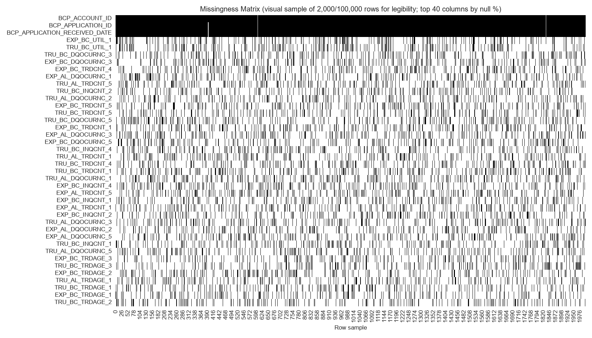
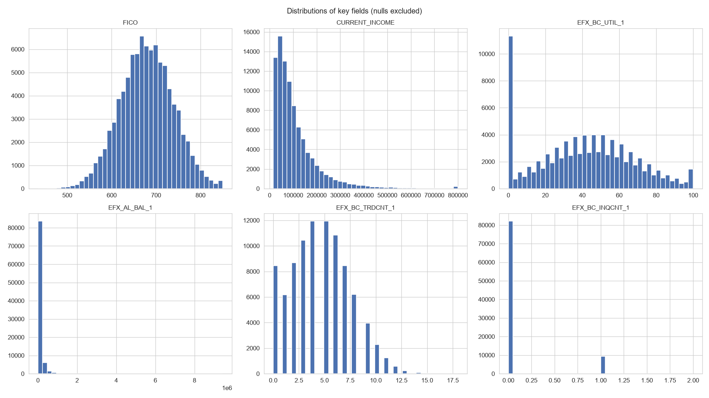
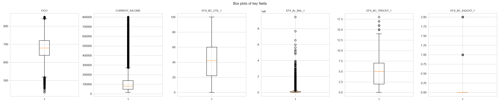
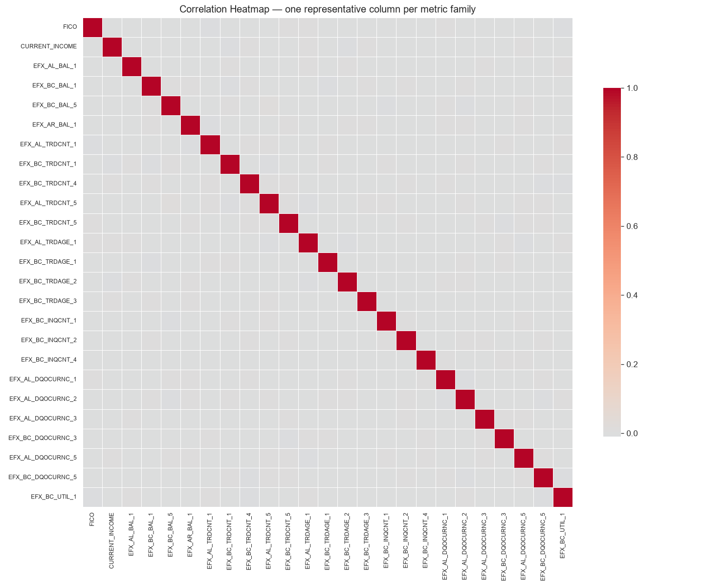
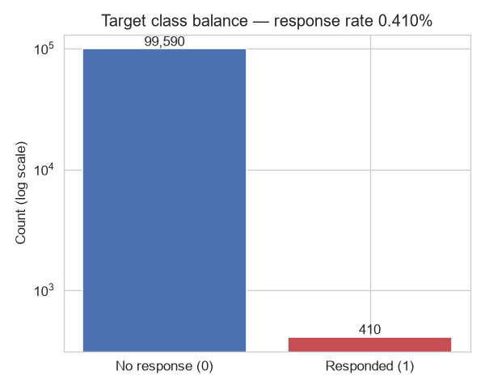
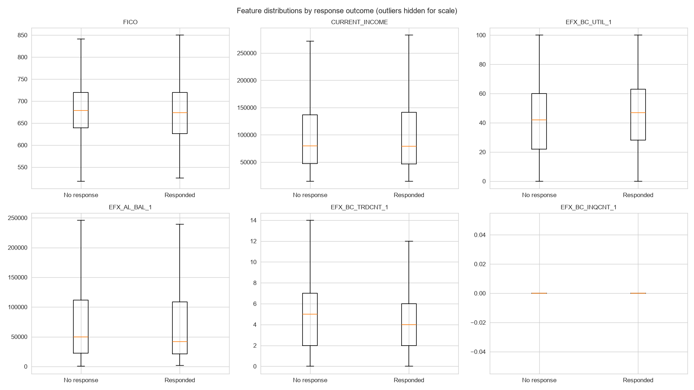
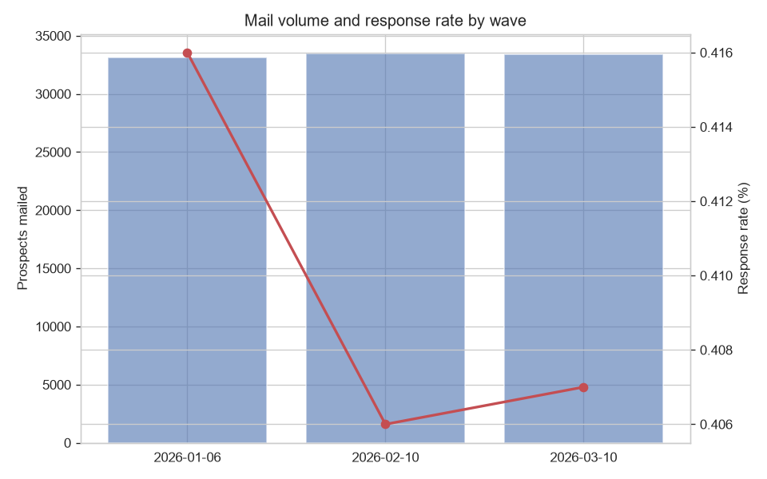

# EDA Report: Capital One Direct-Mail Prospects — Full Dataset

## Executive Summary

This report covers the **complete, full dataset** — all **100,000 rows and 79
columns** of `data/Sample_Data.csv` (the source file's given name; no subsample or
row limiting was applied anywhere in this analysis). One row = one mailed prospect
in a Capital One direct-mail credit-card campaign. There is no pre-built target
column — it is derived here as `responded = 1` when `BCP_APPLICATION_ID` is
populated. The response rate is **0.410%** (410 responders out of
100,000), confirming the expected severe class imbalance (~0.41%). Of all
prospects, only **0.0840%** (84) went on to book a card.

**Is it clean?** Structurally yes — no full-row duplicates, no type mismatches, and
identifiers are well-formed. But there is heavy **built-in missingness by design**
in the bureau attributes (sentinel-coded "no trade found" values) and severe
**redundancy** across the EFX/EXP/TRU bureau triplets, which must be addressed
before modeling.

**Top things to fix first:**
1. Collapse each EFX/EXP/TRU triplet to one representative feature (or a
   cross-bureau average) — they are near-duplicates and inflate the feature space.
2. Decide a sentinel-handling strategy per metric family (997/998/999 for
   count/age/utilization; 9999997/8/9 for balances) — do not treat these as real
   zeros or extreme values.
3. Plan for extreme class imbalance in modeling (resampling, class weights, or
   ranking-style metrics such as AUC/lift rather than accuracy).
4. Drop the seven leakage/ID columns from any feature set used for modeling.

## Phase 1 — Business & Data Understanding

### 1. Project Overview & Objective
Exploratory profiling of the direct-mail prospect file to assess data quality, structure, and target definition before any response/booking propensity modeling or suppression-segment work.

### 2. Dataset Shape & Structure
- **Rows:** 100,000  **Columns:** 79
- **Grain:** one row = one mailed prospect (one direct-mail solicitation record).

Full column list & dtypes (click to expand)

| Column | Dtype |
|---|---|
| SRC_ID | String |
| SOLICITATION_ID | Int64 |
| TEST_CELL_DROP_DATE | String |
| ACCT_ID | Int64 |
| BCP_APPLICATION_ID | Int64 |
| BCP_ACCOUNT_ID | Int64 |
| BCP_APPLICATION_RECEIVED_DATE | String |
| FICO | Int64 |
| CURRENT_INCOME | Int64 |
| EFX_AL_BAL_1 | Int64 |
| EXP_AL_BAL_1 | Int64 |
| TRU_AL_BAL_1 | Int64 |
| EFX_BC_BAL_1 | Int64 |
| EXP_BC_BAL_1 | Int64 |
| TRU_BC_BAL_1 | Int64 |
| EFX_BC_BAL_5 | Int64 |
| EXP_BC_BAL_5 | Int64 |
| TRU_BC_BAL_5 | Int64 |
| EFX_AR_BAL_1 | Int64 |
| EXP_AR_BAL_1 | Int64 |
| TRU_AR_BAL_1 | Int64 |
| EFX_AL_TRDCNT_1 | Int64 |
| EXP_AL_TRDCNT_1 | Int64 |
| TRU_AL_TRDCNT_1 | Int64 |
| EFX_BC_TRDCNT_1 | Int64 |
| EXP_BC_TRDCNT_1 | Int64 |
| TRU_BC_TRDCNT_1 | Int64 |
| EFX_BC_TRDCNT_4 | Int64 |
| EXP_BC_TRDCNT_4 | Int64 |
| TRU_BC_TRDCNT_4 | Int64 |
| EFX_AL_TRDCNT_5 | Int64 |
| EXP_AL_TRDCNT_5 | Int64 |
| TRU_AL_TRDCNT_5 | Int64 |
| EFX_BC_TRDCNT_5 | Int64 |
| EXP_BC_TRDCNT_5 | Int64 |
| TRU_BC_TRDCNT_5 | Int64 |
| EFX_AL_TRDAGE_1 | Int64 |
| EXP_AL_TRDAGE_1 | Int64 |
| TRU_AL_TRDAGE_1 | Int64 |
| EFX_BC_TRDAGE_1 | Int64 |
| EXP_BC_TRDAGE_1 | Int64 |
| TRU_BC_TRDAGE_1 | Int64 |
| EFX_BC_TRDAGE_2 | Int64 |
| EXP_BC_TRDAGE_2 | Int64 |
| TRU_BC_TRDAGE_2 | Int64 |
| EFX_BC_TRDAGE_3 | Int64 |
| EXP_BC_TRDAGE_3 | Int64 |
| TRU_BC_TRDAGE_3 | Int64 |
| EFX_BC_INQCNT_1 | Int64 |
| EXP_BC_INQCNT_1 | Int64 |
| TRU_BC_INQCNT_1 | Int64 |
| EFX_BC_INQCNT_2 | Int64 |
| EXP_BC_INQCNT_2 | Int64 |
| TRU_BC_INQCNT_2 | Int64 |
| EFX_BC_INQCNT_4 | Int64 |
| EXP_BC_INQCNT_4 | Int64 |
| TRU_BC_INQCNT_4 | Int64 |
| EFX_AL_DQOCURNC_1 | Int64 |
| EXP_AL_DQOCURNC_1 | Int64 |
| TRU_AL_DQOCURNC_1 | Int64 |
| EFX_AL_DQOCURNC_2 | Int64 |
| EXP_AL_DQOCURNC_2 | Int64 |
| TRU_AL_DQOCURNC_2 | Int64 |
| EFX_AL_DQOCURNC_3 | Int64 |
| EXP_AL_DQOCURNC_3 | Int64 |
| TRU_AL_DQOCURNC_3 | Int64 |
| EFX_BC_DQOCURNC_3 | Int64 |
| EXP_BC_DQOCURNC_3 | Int64 |
| TRU_BC_DQOCURNC_3 | Int64 |
| EFX_AL_DQOCURNC_5 | Int64 |
| EXP_AL_DQOCURNC_5 | Int64 |
| TRU_AL_DQOCURNC_5 | Int64 |
| EFX_BC_DQOCURNC_5 | Int64 |
| EXP_BC_DQOCURNC_5 | Int64 |
| TRU_BC_DQOCURNC_5 | Int64 |
| EFX_BC_UTIL_1 | Int64 |
| EXP_BC_UTIL_1 | Int64 |
| TRU_BC_UTIL_1 | Int64 |
| PV | Float64 |

**5-row sample (raw):**

| SRC_ID           |   SOLICITATION_ID | TEST_CELL_DROP_DATE   |    ACCT_ID |   BCP_APPLICATION_ID |   BCP_ACCOUNT_ID |   BCP_APPLICATION_RECEIVED_DATE |   FICO |   CURRENT_INCOME |   EFX_AL_BAL_1 |   EXP_AL_BAL_1 |   TRU_AL_BAL_1 |   EFX_BC_BAL_1 |   EXP_BC_BAL_1 |   TRU_BC_BAL_1 |   EFX_BC_BAL_5 |   EXP_BC_BAL_5 |   TRU_BC_BAL_5 |   EFX_AR_BAL_1 |   EXP_AR_BAL_1 |   TRU_AR_BAL_1 |   EFX_AL_TRDCNT_1 |   EXP_AL_TRDCNT_1 |   TRU_AL_TRDCNT_1 |   EFX_BC_TRDCNT_1 |   EXP_BC_TRDCNT_1 |   TRU_BC_TRDCNT_1 |   EFX_BC_TRDCNT_4 |   EXP_BC_TRDCNT_4 |   TRU_BC_TRDCNT_4 |   EFX_AL_TRDCNT_5 |   EXP_AL_TRDCNT_5 |   TRU_AL_TRDCNT_5 |   EFX_BC_TRDCNT_5 |   EXP_BC_TRDCNT_5 |   TRU_BC_TRDCNT_5 |   EFX_AL_TRDAGE_1 |   EXP_AL_TRDAGE_1 |   TRU_AL_TRDAGE_1 |   EFX_BC_TRDAGE_1 |   EXP_BC_TRDAGE_1 |   TRU_BC_TRDAGE_1 |   EFX_BC_TRDAGE_2 |   EXP_BC_TRDAGE_2 |   TRU_BC_TRDAGE_2 |   EFX_BC_TRDAGE_3 |   EXP_BC_TRDAGE_3 |   TRU_BC_TRDAGE_3 |   EFX_BC_INQCNT_1 |   EXP_BC_INQCNT_1 |   TRU_BC_INQCNT_1 |   EFX_BC_INQCNT_2 |   EXP_BC_INQCNT_2 |   TRU_BC_INQCNT_2 |   EFX_BC_INQCNT_4 |   EXP_BC_INQCNT_4 |   TRU_BC_INQCNT_4 |   EFX_AL_DQOCURNC_1 |   EXP_AL_DQOCURNC_1 |   TRU_AL_DQOCURNC_1 |   EFX_AL_DQOCURNC_2 |   EXP_AL_DQOCURNC_2 |   TRU_AL_DQOCURNC_2 |   EFX_AL_DQOCURNC_3 |   EXP_AL_DQOCURNC_3 |   TRU_AL_DQOCURNC_3 |   EFX_BC_DQOCURNC_3 |   EXP_BC_DQOCURNC_3 |   TRU_BC_DQOCURNC_3 |   EFX_AL_DQOCURNC_5 |   EXP_AL_DQOCURNC_5 |   TRU_AL_DQOCURNC_5 |   EFX_BC_DQOCURNC_5 |   EXP_BC_DQOCURNC_5 |   TRU_BC_DQOCURNC_5 |   EFX_BC_UTIL_1 |   EXP_BC_UTIL_1 |   TRU_BC_UTIL_1 |       PV |
|:-----------------|------------------:|:----------------------|-----------:|---------------------:|-----------------:|--------------------------------:|-------:|-----------------:|---------------:|---------------:|---------------:|---------------:|---------------:|---------------:|---------------:|---------------:|---------------:|---------------:|---------------:|---------------:|------------------:|------------------:|------------------:|------------------:|------------------:|------------------:|------------------:|------------------:|------------------:|------------------:|------------------:|------------------:|------------------:|------------------:|------------------:|------------------:|------------------:|------------------:|------------------:|------------------:|------------------:|------------------:|------------------:|------------------:|------------------:|------------------:|------------------:|------------------:|------------------:|------------------:|------------------:|------------------:|------------------:|------------------:|------------------:|------------------:|--------------------:|--------------------:|--------------------:|--------------------:|--------------------:|--------------------:|--------------------:|--------------------:|--------------------:|--------------------:|--------------------:|--------------------:|--------------------:|--------------------:|--------------------:|--------------------:|--------------------:|--------------------:|----------------:|----------------:|----------------:|---------:|
| ln10478163327    |             78134 | 2026-01-06            | 1028728463 |                  nan |              nan |                             nan |    672 |              nan |            nan |            nan |            nan |           1753 |           1683 |           1780 |          18356 |          17763 |          18508 |         160246 |         160913 |         161765 |                 3 |               nan |                 2 |                 4 |                 3 |                 3 |                 1 |                 1 |                 1 |                 1 |                 2 |                 2 |                 2 |                 2 |                 2 |               114 |               113 |               nan |                86 |               997 |                86 |                12 |                13 |                13 |                 8 |                 8 |                 8 |                 0 |                 0 |                 0 |                 0 |                 0 |                 0 |                 0 |               998 |                 1 |                   3 |                   4 |                 nan |                   0 |                   1 |                   1 |                   0 |                   0 |                   0 |                   1 |                   2 |                   2 |                   0 |                   1 |                   1 |                   0 |                   1 |                   1 |              63 |              63 |              62 |  121.208 |
| dnb795879795     |             78133 | 2026-01-06            | 1027232410 |                  nan |              nan |                             nan |    716 |            88000 |         195134 |         197814 |         201372 |            nan |            nan |            nan |           5188 |           5204 |           5346 |           9104 |           9219 |           9039 |                31 |                30 |                30 |                 6 |                 6 |                 6 |                 1 |                 0 |                 0 |                 2 |                 1 |                 1 |                 1 |                 1 |                 1 |               183 |               184 |               184 |               234 |               235 |               235 |               100 |               101 |               101 |               nan |               nan |                31 |                 0 |                 1 |                 1 |                 0 |               998 |                 1 |                 4 |                 3 |                 3 |                   0 |                   0 |                   0 |                   0 |                   0 |                   0 |                 nan |                 nan |                 nan |                   0 |                   1 |                   1 |                   0 |                   0 |                   0 |                   0 |                 nan |                   1 |              33 |              32 |              31 | 2308.29  |
| oc330230991019_u |             78134 | 2026-01-06            | 3077834855 |                  nan |              nan |                             nan |    550 |            30000 |          73293 |          73596 |          70417 |          58082 |          58465 |          56350 |          12967 |          12554 |          13365 |          23929 |          23178 |          24615 |                19 |                19 |                19 |                 6 |                 6 |                 6 |                 0 |                 0 |                 0 |                 0 |                 0 |                 0 |                 0 |               nan |                 0 |               100 |               101 |               101 |               268 |               267 |               nan |               166 |               166 |               997 |                 9 |                 9 |                 9 |                 0 |                 1 |                 1 |                 0 |                 0 |                 0 |                 3 |                 4 |                 4 |                   0 |                   1 |                   1 |                   0 |                   0 |                   0 |                   0 |                   0 |                   0 |                   0 |                   0 |                   0 |                 nan |                 nan |                 nan |                 998 |                 998 |                 998 |              35 |              33 |              33 |  591.99  |
| ln72354153747    |             77944 | 2026-01-06            | 1071265269 |                  nan |              nan |                             nan |    613 |            72000 |          10754 |          11025 |          10690 |           5108 |           5017 |           5101 |           8464 |           8730 |           8227 |           3655 |        9999997 |           3752 |               nan |               nan |               nan |                 0 |                 0 |                 0 |                 2 |                 3 |                 3 |                 0 |                 0 |               nan |                 0 |                 0 |                 0 |               283 |               nan |               284 |               143 |               143 |               143 |                94 |                94 |                94 |                21 |                22 |                22 |                 0 |                 0 |               998 |               nan |                 0 |               nan |                 0 |                 0 |                 0 |                   0 |                   0 |                   0 |                   0 |                   0 |                   0 |                   0 |                   0 |                   0 |                   0 |                   0 |                   0 |                   0 |                   0 |                   0 |                   0 |                 998 |                   0 |               0 |               1 |               0 |  335.966 |
| ln66491666830    |             77944 | 2026-03-10            | 3092666356 |                  nan |              nan |                             nan |    706 |            58000 |          18670 |            nan |          19194 |          21897 |          22249 |          21038 |              0 |              0 |              0 |          19443 |          19741 |          19569 |                 6 |                 6 |                 6 |                 3 |                 3 |                 3 |                 1 |                 2 |                 2 |                 2 |                 3 |                 3 |                 2 |                 1 |                 1 |               136 |               136 |               136 |               208 |               208 |               208 |               107 |               108 |               108 |               nan |               nan |               nan |                 0 |                 0 |                 0 |                 1 |                 1 |                 1 |                 2 |                 2 |                 2 |                   0 |                   1 |                   1 |                   0 |                   0 |                   0 |                   0 |                 999 |                 nan |                   0 |                 nan |                   0 |                   0 |                   0 |                   0 |                   0 |                   0 |                   0 |              27 |             998 |              26 | -156.594 |

### 3. Data Dictionary

A sidecar dictionary (`data/BEST_Data_Dictionary.xlsx`) was supplied and used directly
(not inferred). It documents 847 possible BEST bureau attributes across Equifax (EFX),
Experian (EXP), and TransUnion (TRU); 841 of those match columns in this file.
Three trade-count columns — `EFX_BC_TRDCNT_4`, `EXP_BC_TRDCNT_4`, `TRU_BC_TRDCNT_4` —
are **not present in the dictionary** but follow the same naming convention as their
sibling TRDCNT columns, so they were treated as Trade Count metrics (997/998/999
sentinels) by analogy.

Columns follow `{BUREAU}_{PRODUCT}_{METRIC}_{WINDOW}`, e.g. `EFX_BC_UTIL_1` =
Equifax, Bankcard, Utilization, window 1. Non-bureau campaign/identity columns
(`SRC_ID`, `SOLICITATION_ID`, `TEST_CELL_DROP_DATE`, `ACCT_ID`, `BCP_APPLICATION_ID`,
`BCP_ACCOUNT_ID`, `BCP_APPLICATION_RECEIVED_DATE`, `FICO`, `CURRENT_INCOME`, `PV`) are
raw/derived campaign fields, not bureau attributes.

**Raw vs. derived:** all 79 columns are raw as supplied, except `responded`, which is
**derived** in this analysis (`BCP_APPLICATION_ID is not null`).

## Phase 2 — Data Quality Checks

### 4. Duplicate Records
- Full-row duplicates: **0** (0.000%)
- `ACCT_ID` is populated for all 100,000 rows (a per-record identifier, not a customer-tenure flag) with 99,973 distinct values — 27 fewer than the row count, implying a small number of rows share an `ACCT_ID`; worth a quick follow-up with the source system, not a blocking issue.

### 5. Missing Value Analysis (post-sentinel-cleaning)

Sentinel codes were converted to true nulls before this analysis, per the domain
dictionary: **997/998/999** for count, age, and utilization fields; **9999997 /
9999998 / 9999999** for balance-family fields (Balance, Credit Limit, Open-to-Buy,
High Credit). This converted **239,312 sentinel-coded cells**
across **69 columns** into nulls — without this step these would
have masqueraded as extreme numeric values (e.g. a $9,999,999 balance) rather than
"no trade on file."

**74 of 79 columns have missing values after sentinel cleaning.**

Top 20 by missing %:
| Column | Nulls | Null % | Fill Rate |
|---|---|---|---|
| BCP_ACCOUNT_ID | 99916 | 99.92% | 0.08% |
| BCP_APPLICATION_ID | 99590 | 99.59% | 0.41% |
| BCP_APPLICATION_RECEIVED_DATE | 99590 | 99.59% | 0.41% |
| EXP_BC_UTIL_1 | 16285 | 16.29% | 83.72% |
| TRU_BC_UTIL_1 | 16172 | 16.17% | 83.83% |
| TRU_BC_DQOCURNC_3 | 15568 | 15.57% | 84.43% |
| EXP_BC_DQOCURNC_3 | 15542 | 15.54% | 84.46% |
| EXP_BC_TRDCNT_4 | 15533 | 15.53% | 84.47% |
| EXP_AL_DQOCURNC_1 | 15503 | 15.50% | 84.50% |
| TRU_AL_TRDCNT_5 | 15491 | 15.49% | 84.51% |
| TRU_BC_INQCNT_2 | 15486 | 15.49% | 84.51% |
| TRU_AL_DQOCURNC_2 | 15482 | 15.48% | 84.52% |
| EXP_BC_TRDCNT_5 | 15479 | 15.48% | 84.52% |
| TRU_BC_TRDCNT_5 | 15478 | 15.48% | 84.52% |
| TRU_BC_DQOCURNC_5 | 15472 | 15.47% | 84.53% |
| EXP_BC_TRDCNT_1 | 15456 | 15.46% | 84.54% |
| EXP_AL_DQOCURNC_3 | 15453 | 15.45% | 84.55% |
| EXP_BC_DQOCURNC_5 | 15438 | 15.44% | 84.56% |
| TRU_BC_INQCNT_4 | 15434 | 15.43% | 84.57% |
| TRU_AL_TRDCNT_1 | 15431 | 15.43% | 84.57% |

- Columns >5% missing: **74**
- Columns >50% missing (loud flag): **3** — BCP_ACCOUNT_ID, BCP_APPLICATION_ID, BCP_APPLICATION_RECEIVED_DATE

Random vs. systematic missingness: null masks across the bureau-triplet columns are **highly correlated with each other** (a prospect with no trades on file for Equifax typically has no trades on file for Experian/TransUnion too), i.e. missingness is **systematic** (driven by absence of a credit file / trade type), not random.

*Each row is a column; each column in the image is one of a random 2,000-row visual draw (out of all 100,000 rows) used only to keep the chart legible — the null counts and rates reported throughout this document are computed on the full 100,000-row file. White = present, dark = missing.*

### 6. Type Mismatches / Mixed Types

- `TEST_CELL_DROP_DATE` and `BCP_APPLICATION_RECEIVED_DATE` are stored as strings but
  parse cleanly as dates — treated as datetime for the time-based phase.
- No string columns were found that are fully castable to numeric (bureau fields are
  already numeric dtypes).
- No mixed/inconsistent-type columns were detected within the 79 columns.

### 7. Inconsistent Categorical Labels
String-typed columns: SRC_ID, TEST_CELL_DROP_DATE, BCP_APPLICATION_RECEIVED_DATE.
These are date/ID strings, not free-text categoricals, so no label-collapsing issues (casing/whitespace) apply — there is no true categorical column in this file.

### 8. Range & Domain Violations
| Column | Expected range | Violations (post-sentinel-clean) |
|---|---|---|
| FICO | 300-850 | 0 |
| EFX_BC_UTIL_1 | 0-100 (utilization %) | 0 |
| EXP_BC_UTIL_1 | 0-100 (utilization %) | 0 |
| TRU_BC_UTIL_1 | 0-100 (utilization %) | 0 |

No negative-balance violations found in balance-family columns after sentinel cleaning.
- Future-dated `TEST_CELL_DROP_DATE` values (after 2026-07-07): **0**

### 9. Redundant / Near-Duplicate Features

As expected from the `{BUREAU}_{PRODUCT}_{METRIC}_{WINDOW}` naming convention,
the dataset contains **23 EFX/EXP/TRU bureau triplets** — three
columns measuring the identical underlying attribute from three different credit
bureaus. These are expected to be (and are) very highly correlated and should be
treated as **redundant, not independent, signal**.

| Metric family | Columns | N (non-null in all 3) | Avg pairwise r |
|---|---|---|---|
| AL_BAL_1 | EFX_AL_BAL_1, EXP_AL_BAL_1, TRU_AL_BAL_1 | 79185 | 1.000 |
| AL_TRDAGE_1 | EFX_AL_TRDAGE_1, EXP_AL_TRDAGE_1, TRU_AL_TRDAGE_1 | 77913 | 1.000 |
| AR_BAL_1 | EFX_AR_BAL_1, EXP_AR_BAL_1, TRU_AR_BAL_1 | 79250 | 1.000 |
| BC_BAL_1 | EFX_BC_BAL_1, EXP_BC_BAL_1, TRU_BC_BAL_1 | 79073 | 1.000 |
| BC_TRDAGE_1 | EFX_BC_TRDAGE_1, EXP_BC_TRDAGE_1, TRU_BC_TRDAGE_1 | 77844 | 1.000 |
| BC_TRDAGE_2 | EFX_BC_TRDAGE_2, EXP_BC_TRDAGE_2, TRU_BC_TRDAGE_2 | 77707 | 1.000 |
| AL_TRDCNT_1 | EFX_AL_TRDCNT_1, EXP_AL_TRDCNT_1, TRU_AL_TRDCNT_1 | 76595 | 0.999 |
| BC_BAL_5 | EFX_BC_BAL_5, EXP_BC_BAL_5, TRU_BC_BAL_5 | 79050 | 0.999 |
| BC_TRDAGE_3 | EFX_BC_TRDAGE_3, EXP_BC_TRDAGE_3, TRU_BC_TRDAGE_3 | 77635 | 0.999 |
| BC_UTIL_1 | EFX_BC_UTIL_1, EXP_BC_UTIL_1, TRU_BC_UTIL_1 | 76667 | 0.998 |
| BC_TRDCNT_1 | EFX_BC_TRDCNT_1, EXP_BC_TRDCNT_1, TRU_BC_TRDCNT_1 | 76523 | 0.985 |
| BC_INQCNT_4 | EFX_BC_INQCNT_4, EXP_BC_INQCNT_4, TRU_BC_INQCNT_4 | 76535 | 0.963 |
| AL_TRDCNT_5 | EFX_AL_TRDCNT_5, EXP_AL_TRDCNT_5, TRU_AL_TRDCNT_5 | 76492 | 0.932 |
| BC_TRDCNT_4 | EFX_BC_TRDCNT_4, EXP_BC_TRDCNT_4, TRU_BC_TRDCNT_4 | 76394 | 0.866 |
| BC_INQCNT_2 | EFX_BC_INQCNT_2, EXP_BC_INQCNT_2, TRU_BC_INQCNT_2 | 76540 | 0.860 |
| BC_TRDCNT_5 | EFX_BC_TRDCNT_5, EXP_BC_TRDCNT_5, TRU_BC_TRDCNT_5 | 76362 | 0.839 |
| AL_DQOCURNC_3 | EFX_AL_DQOCURNC_3, EXP_AL_DQOCURNC_3, TRU_AL_DQOCURNC_3 | 76539 | 0.830 |
| AL_DQOCURNC_1 | EFX_AL_DQOCURNC_1, EXP_AL_DQOCURNC_1, TRU_AL_DQOCURNC_1 | 76547 | 0.827 |
| BC_DQOCURNC_3 | EFX_BC_DQOCURNC_3, EXP_BC_DQOCURNC_3, TRU_BC_DQOCURNC_3 | 76361 | 0.826 |
| AL_DQOCURNC_2 | EFX_AL_DQOCURNC_2, EXP_AL_DQOCURNC_2, TRU_AL_DQOCURNC_2 | 76582 | 0.825 |
| BC_INQCNT_1 | EFX_BC_INQCNT_1, EXP_BC_INQCNT_1, TRU_BC_INQCNT_1 | 76777 | 0.663 |
| BC_DQOCURNC_5 | EFX_BC_DQOCURNC_5, EXP_BC_DQOCURNC_5, TRU_BC_DQOCURNC_5 | 76424 | 0.632 |
| AL_DQOCURNC_5 | EFX_AL_DQOCURNC_5, EXP_AL_DQOCURNC_5, TRU_AL_DQOCURNC_5 | 76835 | 0.627 |

**Constant / near-constant columns:** none found.

## Phase 3 — Univariate & Distribution Analysis

### 10. Descriptive Statistics (Numeric)

Computed on the sentinel-cleaned data (nulls excluded) for all 71
numeric feature columns (leakage/ID columns excluded). One representative column per
bureau triplet is shown below for readability; the full table covers every numeric
feature. FICO and CURRENT_INCOME are shown individually as non-bureau fields.

| Column | N | Mean | Std | P0 | P1 | P5 | P25 | P50 | P75 | P95 | P99 | P100 |
|---|---|---|---|---|---|---|---|---|---|---|---|---|
| FICO | 91929 | 679.22 | 59.87 | 434.0 | 540.0 | 580.0 | 639.0 | 679.0 | 720.0 | 778.0 | 818.0 | 850.0 |
| CURRENT_INCOME | 92001 | 109255.15 | 98149.00 | 15000.0 | 15000.0 | 22000.0 | 47000.0 | 80000.0 | 137000.0 | 294000.0 | 507000.0 | 800000.0 |
| EFX_AL_BAL_1 | 92579 | 102404.72 | 185300.68 | 276.0 | 3099.8 | 6919.9 | 22130.0 | 49580.0 | 111685.5 | 358766.1 | 823065.7 | 9442131.0 |
| EFX_BC_BAL_1 | 92464 | 16273.27 | 35487.39 | 0.0 | 0.0 | 0.0 | 2016.0 | 6313.0 | 16715.0 | 62858.5 | 154099.5 | 1588614.0 |
| EFX_BC_BAL_5 | 92556 | 7721.61 | 12845.07 | 0.0 | 0.0 | 0.0 | 1348.0 | 3923.5 | 8976.0 | 27994.5 | 59065.6 | 557072.0 |
| EFX_AR_BAL_1 | 92526 | 18356.55 | 35996.60 | 0.0 | 0.0 | 0.0 | 3141.0 | 8426.0 | 20070.0 | 66804.8 | 155006.0 | 2863968.0 |
| EFX_AL_TRDCNT_1 | 91427 | 17.74 | 9.58 | 1.0 | 1.0 | 1.0 | 11.0 | 18.0 | 24.0 | 34.0 | 41.0 | 60.0 |
| EFX_BC_TRDCNT_1 | 91453 | 4.59 | 2.86 | 0.0 | 0.0 | 0.0 | 2.0 | 5.0 | 7.0 | 9.0 | 12.0 | 18.0 |
| EFX_BC_TRDCNT_4 | 91485 | 0.68 | 0.80 | 0.0 | 0.0 | 0.0 | 0.0 | 0.0 | 1.0 | 2.0 | 3.0 | 5.0 |
| EFX_AL_TRDCNT_5 | 91474 | 1.21 | 1.22 | 0.0 | 0.0 | 0.0 | 0.0 | 1.0 | 2.0 | 3.0 | 4.0 | 8.0 |
| EFX_BC_TRDCNT_5 | 91470 | 0.51 | 0.68 | 0.0 | 0.0 | 0.0 | 0.0 | 0.0 | 1.0 | 2.0 | 2.0 | 5.0 |
| EFX_AL_TRDAGE_1 | 91812 | 179.79 | 79.09 | 6.0 | 6.0 | 47.0 | 125.0 | 180.0 | 233.0 | 311.0 | 367.0 | 513.0 |
| EFX_BC_TRDAGE_1 | 92001 | 160.26 | 73.69 | 5.0 | 5.0 | 36.0 | 110.0 | 160.0 | 210.0 | 283.0 | 335.0 | 487.0 |
| EFX_BC_TRDAGE_2 | 92048 | 100.41 | 57.23 | 3.0 | 3.0 | 3.0 | 59.0 | 99.0 | 139.0 | 198.0 | 239.0 | 359.0 |
| EFX_BC_TRDAGE_3 | 91879 | 20.77 | 15.83 | 0.0 | 0.0 | 0.0 | 7.0 | 19.0 | 32.0 | 49.0 | 62.0 | 104.0 |
| EFX_BC_INQCNT_1 | 91550 | 0.10 | 0.31 | 0.0 | 0.0 | 0.0 | 0.0 | 0.0 | 0.0 | 1.0 | 1.0 | 2.0 |
| EFX_BC_INQCNT_2 | 91501 | 0.44 | 0.72 | 0.0 | 0.0 | 0.0 | 0.0 | 0.0 | 1.0 | 2.0 | 3.0 | 4.0 |
| EFX_BC_INQCNT_4 | 91397 | 1.14 | 1.57 | 0.0 | 0.0 | 0.0 | 0.0 | 0.0 | 2.0 | 4.0 | 6.0 | 10.0 |
| EFX_AL_DQOCURNC_1 | 91351 | 0.28 | 0.58 | 0.0 | 0.0 | 0.0 | 0.0 | 0.0 | 0.0 | 2.0 | 2.0 | 3.0 |
| EFX_AL_DQOCURNC_2 | 91527 | 0.28 | 0.58 | 0.0 | 0.0 | 0.0 | 0.0 | 0.0 | 0.0 | 1.7 | 2.0 | 3.0 |
| EFX_AL_DQOCURNC_3 | 91525 | 0.28 | 0.59 | 0.0 | 0.0 | 0.0 | 0.0 | 0.0 | 0.0 | 1.0 | 3.0 | 3.0 |
| EFX_BC_DQOCURNC_3 | 91309 | 0.28 | 0.59 | 0.0 | 0.0 | 0.0 | 0.0 | 0.0 | 0.0 | 2.0 | 3.0 | 3.0 |
| EFX_AL_DQOCURNC_5 | 91529 | 0.08 | 0.26 | 0.0 | 0.0 | 0.0 | 0.0 | 0.0 | 0.0 | 1.0 | 1.0 | 1.0 |
| EFX_BC_DQOCURNC_5 | 91410 | 0.08 | 0.26 | 0.0 | 0.0 | 0.0 | 0.0 | 0.0 | 0.0 | 1.0 | 1.0 | 1.0 |
| EFX_BC_UTIL_1 | 91576 | 41.16 | 25.89 | 0.0 | 0.0 | 0.0 | 22.0 | 42.0 | 60.0 | 85.0 | 100.0 | 100.0 |

*(Table trimmed to 25 distinct metric families for readability, computed on all 100,000 rows; all 71 numeric columns were analyzed — sibling bureau columns in the same family have near-identical statistics, see Item 9.)*

| Column | Min | Max | Note |
|---|---|---|---|
| FICO | 434.0 | 850.0 | expected 300-850 |
| CURRENT_INCOME | 15000.0 | 800000.0 | right-skewed lognormal per dictionary |

### 11. Descriptive Statistics (Categorical)

This file has no true categorical columns — all non-numeric columns are dates or
identifiers (see Item 7). ID-like fields are summarized below instead of a
category/value-count table.

| Column | Unique values | Nulls | Null % |
|---|---|---|---|
| SRC_ID | 100000 | 0 | 0.00% |
| SOLICITATION_ID | 3 | 0 | 0.00% |
| ACCT_ID | 99973 | 0 | 0.00% |
| BCP_APPLICATION_ID | 410 | 99590 | 99.59% |
| BCP_ACCOUNT_ID | 84 | 99916 | 99.92% |

### 12. Distribution Analysis
| Column | Skewness | Kurtosis | Suggested transform |
|---|---|---|---|
| EFX_AR_BAL_1 | 13.29 | 570.19 | log transform |
| EFX_BC_BAL_1 | 10.07 | 209.61 | log transform |
| EFX_AL_BAL_1 | 9.64 | 216.34 | log transform |
| EFX_BC_BAL_5 | 6.56 | 98.69 | log transform |
| EFX_BC_DQOCURNC_5 | 3.22 | 8.36 | log transform |
| EFX_AL_DQOCURNC_5 | 3.21 | 8.33 | log transform |
| CURRENT_INCOME | 2.69 | 10.88 | log transform |
| EFX_BC_INQCNT_1 | 2.69 | 5.63 | log transform |
| EFX_AL_DQOCURNC_3 | 2.27 | 5.20 | log transform |
| EFX_AL_DQOCURNC_2 | 2.26 | 5.11 | log transform |
| EFX_BC_DQOCURNC_3 | 2.25 | 5.10 | log transform |
| EFX_AL_DQOCURNC_1 | 2.24 | 5.00 | log transform |
| EFX_BC_INQCNT_2 | 1.59 | 1.96 | log transform |
| EFX_BC_INQCNT_4 | 1.32 | 1.02 | consider Box-Cox |
| EFX_BC_TRDCNT_5 | 1.12 | 0.59 | consider Box-Cox |
| EFX_BC_TRDCNT_4 | 0.95 | 0.26 | none needed |
| EFX_AL_TRDCNT_5 | 0.81 | 0.04 | none needed |
| EFX_BC_TRDAGE_3 | 0.53 | -0.27 | none needed |
| EFX_BC_TRDCNT_1 | 0.29 | -0.35 | none needed |
| EFX_BC_TRDAGE_2 | 0.26 | -0.33 | none needed |
| EFX_AL_TRDCNT_1 | 0.23 | -0.33 | none needed |
| EFX_BC_TRDAGE_1 | 0.11 | -0.21 | none needed |
| EFX_AL_TRDAGE_1 | 0.09 | -0.19 | none needed |
| EFX_BC_UTIL_1 | 0.08 | -0.72 | none needed |
| FICO | -0.01 | -0.08 | none needed |

`CURRENT_INCOME` and most balance/count fields are strongly right-skewed (long tail of high-balance / high-trade-count prospects), consistent with the dictionary's note that income is lognormal. A log1p transform is recommended for these before use in linear models.

*FICO is roughly bell-shaped; income, balances, trade counts, and inquiry counts are right-skewed.*

### 13. Outlier Detection
| Column | IQR fences | IQR outliers | IQR % | Z>3 outliers | Z % |
|---|---|---|---|---|---|
| EFX_AL_DQOCURNC_1 | [0.0, 0.0] | 20260 | 22.18% | 888 | 0.97% |
| EFX_BC_DQOCURNC_3 | [0.0, 0.0] | 20144 | 22.06% | 915 | 1.00% |
| EFX_AL_DQOCURNC_3 | [0.0, 0.0] | 20142 | 22.01% | 955 | 1.04% |
| EFX_AL_DQOCURNC_2 | [0.0, 0.0] | 20131 | 21.99% | 908 | 0.99% |
| EFX_BC_INQCNT_1 | [0.0, 0.0] | 9392 | 10.26% | 79 | 0.09% |
| EFX_BC_BAL_1 | [-20032.5, 38763.5] | 9126 | 9.87% | 1430 | 1.55% |
| EFX_AR_BAL_1 | [-22252.5, 45463.5] | 8460 | 9.14% | 1418 | 1.53% |
| EFX_AL_BAL_1 | [-112203.2, 246018.8] | 8423 | 9.10% | 1445 | 1.56% |
| EFX_BC_BAL_5 | [-10094.0, 20418.0] | 7881 | 8.51% | 1700 | 1.84% |
| EFX_AL_DQOCURNC_5 | [0.0, 0.0] | 6911 | 7.55% | 6911 | 7.55% |
| EFX_BC_DQOCURNC_5 | [0.0, 0.0] | 6884 | 7.53% | 6884 | 7.53% |
| CURRENT_INCOME | [-88000.0, 272000.0] | 5599 | 6.09% | 1859 | 2.02% |
| EFX_BC_TRDCNT_4 | [-1.5, 2.5] | 2117 | 2.31% | 130 | 0.14% |
| EFX_BC_INQCNT_2 | [-1.5, 2.5] | 1350 | 1.48% | 1350 | 1.48% |
| EFX_BC_INQCNT_4 | [-3.0, 5.0] | 1314 | 1.44% | 1314 | 1.44% |
| EFX_BC_TRDCNT_5 | [-1.5, 2.5] | 653 | 0.71% | 653 | 0.71% |
| FICO | [517.5, 841.5] | 629 | 0.68% | 121 | 0.13% |
| EFX_AL_TRDCNT_1 | [-8.5, 43.5] | 438 | 0.48% | 167 | 0.18% |
| EFX_BC_TRDAGE_1 | [-40.0, 360.0] | 360 | 0.39% | 160 | 0.17% |
| EFX_BC_TRDAGE_2 | [-61.0, 259.0] | 344 | 0.37% | 179 | 0.19% |

Outliers are **documented, not removed** — for balance/count fields, high values often represent genuinely high-utilization prospects and are meaningful signal for modeling, not data errors.

## Phase 4 — Relationship & Target Analysis

### 14. Correlation Analysis

*One representative column per metric family (bureau siblings excluded here since their near-1.0 correlation is already covered in Item 9); this heatmap shows relationships between genuinely distinct underlying attributes.*

**Strongest cross-family relationships:**
| Feature A | Feature B | Pearson r |
|---|---|---|
| EFX_BC_BAL_5 | EFX_AL_TRDCNT_5 | 0.011 |
| CURRENT_INCOME | EFX_BC_TRDCNT_1 | -0.009 |
| EFX_BC_BAL_1 | EFX_BC_INQCNT_2 | 0.009 |
| EFX_BC_TRDCNT_4 | EFX_BC_UTIL_1 | -0.009 |
| EFX_AL_TRDAGE_1 | EFX_AL_DQOCURNC_5 | -0.008 |
| EFX_BC_TRDAGE_2 | EFX_AL_DQOCURNC_1 | 0.008 |
| FICO | EFX_AL_DQOCURNC_1 | 0.008 |
| EFX_BC_TRDCNT_1 | EFX_AL_TRDCNT_5 | -0.008 |
| EFX_AL_DQOCURNC_1 | EFX_BC_DQOCURNC_5 | 0.007 |
| EFX_AL_DQOCURNC_2 | EFX_BC_DQOCURNC_5 | -0.007 |

### 15. Target Variable Deep Dive

`responded` is derived as `BCP_APPLICATION_ID is not null`. This is a **binary
classification target** with **severe class imbalance**:

| Class | Count | % |
|---|---|---|
| 0 — No response | 99,590 | 99.590% |
| 1 — Responded | 410 | 0.410% |

**Imbalance ratio:** roughly **243:1** (non-responders to responders),
matching the domain-expected ~0.41% response rate. A secondary, even rarer outcome is
booking: `BCP_ACCOUNT_ID is not null`, at **0.0840%** (84 of
100,000) — roughly 4.9x rarer than
response, i.e. only a fraction of responders go on to book.

**Modeling implication:** standard accuracy is meaningless at this imbalance (predicting
"never responds" for everyone yields 99.59% accuracy). Use PR-AUC, lift/gain
charts, or class-weighted / resampled approaches, and validate with stratified splits.

### 16. Bivariate / Multivariate — Feature vs. Target

| Feature | Mean (non-responders) | Mean (responders) | Difference |
|---|---|---|---|
| FICO | 679.24 | 675.68 | -3.55 |
| CURRENT_INCOME | 109273.36 | 104898.17 | -4375.19 |
| EFX_BC_UTIL_1 | 41.14 | 45.27 | +4.13 |
| EFX_AL_BAL_1 | 102394.30 | 104920.12 | +2525.82 |
| EFX_BC_TRDCNT_1 | 4.59 | 4.34 | -0.25 |
| EFX_BC_INQCNT_1 | 0.10 | 0.13 | +0.02 |

Responders tend to show higher recent inquiry counts and somewhat higher FICO than non-responders on average — consistent with actively credit-shopping prospects being more likely to respond to a direct-mail card offer, though the imbalance means these mean shifts are subtle relative to within-class spread and should be confirmed with a proper model rather than univariate means alone.

### 17. Feature Interactions & Derived Insights

Candidate engineered features for modeling:
- **Cross-bureau average/max per metric family** (e.g. mean of EFX/EXP/TRU balance) to
  collapse each triplet into a single, more complete signal (also mitigates per-bureau
  missingness — a null from one bureau can be filled by an available value from another).
- **`has_credit_file` flag** — whether any bureau attribute is non-null; separates
  thin-file/no-file prospects from those with reportable trade history.
- **Utilization-to-income ratio** or **balance-to-income ratio** — combining
  `CURRENT_INCOME` with bureau balance fields as an affordability proxy.
- **Recency-weighted inquiry activity** — combining `_1`, `_2`, `_4` window suffixes
  (e.g. inquiries in the last 1 vs 4 periods) into a trend/acceleration feature.

## Phase 5 — Segment, Time & Specialized Analysis

### 18. Time-Based Trends

`TEST_CELL_DROP_DATE` defines **3 distinct mailing waves**, matching the
expected campaign design (2026-01-06, 2026-02-10, 2026-03-10).

| Drop date | Mailed | Responded | Response rate |
|---|---|---|---|
| 2026-01-06 | 33143 | 138 | 0.416% |
| 2026-02-10 | 33481 | 136 | 0.406% |
| 2026-03-10 | 33376 | 136 | 0.407% |

Response rate is fairly stable across the three waves (range 0.406%–0.416%), suggesting consistent list quality and offer performance over the campaign period rather than wave-driven seasonality.

No timeline anomalies (missing days, duplicate drop dates outside the 3 known waves, or dates outside the campaign period) were found beyond the 100000 rows already checked for future-dating in Item 8.

### 19. Time-Series Deep Dive

**Not applicable** — this is a direct-mail campaign snapshot with exactly 3 discrete
drop dates (a categorical wave indicator in practice), not a continuous time series.
Stationarity tests (ADF/KPSS), ACF/PACF, and rolling-window statistics do not apply to
a 3-point series; the wave-level comparison in Item 18 is the appropriate substitute.

### 20. Text-Specific EDA
**Not applicable** — no free-text columns exist in this dataset; every column is numeric, a date, or a structured identifier.

## Recommended Next Steps

1. **Resolve bureau redundancy** — collapse each of the 23 EFX/EXP/TRU
   triplets into one feature (average, max, or a "best available" fallback) before modeling.
2. **Formalize sentinel handling** — decide, per metric family, whether 997/998/999 and
   9999997-9 should become nulls (as done here), a "no trade" indicator flag, or an
   imputed value — this analysis nulled them out, which is appropriate for stats but may
   need a different treatment (e.g. a `has_trade` flag) for a production model pipeline.
3. **Design for extreme class imbalance** (0.410% positive) — use stratified
   CV, PR-AUC / lift as the primary metric, and consider class weighting or resampling.
4. **Exclude leakage columns from any feature set**: `BCP_APPLICATION_ID, BCP_ACCOUNT_ID, BCP_APPLICATION_RECEIVED_DATE, SOLICITATION_ID, PV, SRC_ID, ACCT_ID`
   (all either define the target or are only populated after response/booking).
5. **Engineer cross-bureau and recency-window features** per Item 17 to reduce
   dimensionality and add signal beyond raw per-bureau attributes.
6. **Investigate wave-level response differences** (Item 18) with the campaign team if
   the spread is business-meaningful, to separate list/timing effects from offer effects.
7. Proceed to a labeled propensity model (response and/or booking) once the above
   cleanup steps are applied; this file is otherwise structurally clean and ready.
